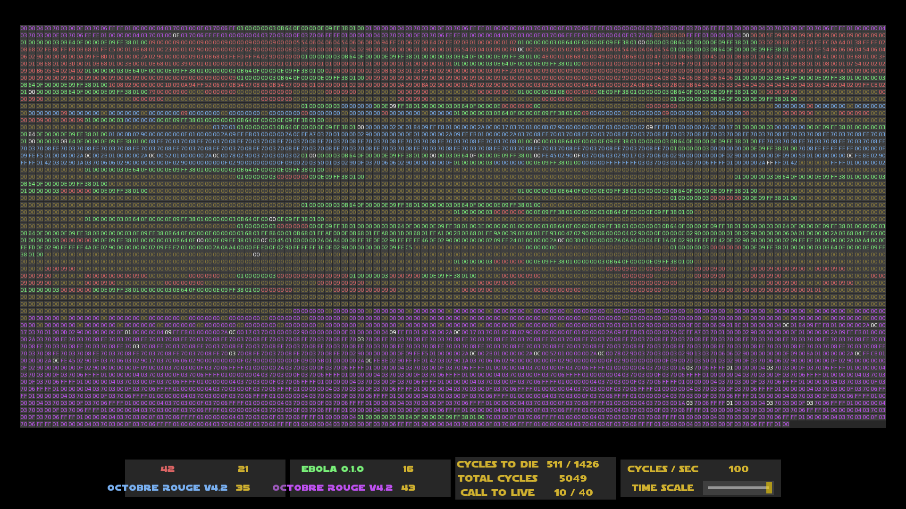

# Corewar
- **Contributors:**
  - [Léo Wehrle - Rentmeister](https://github.com/leoWherle)
  - [Théodore Magna](https://github.com/TheodoreEpitech)
  - [Martin Sabatier](https://github.com/Nevi1)
  - [Nathanaël Kimbembe--Croissant](https://github.com/Nathanael-Kimbembe)
  - [Lucien Pineau](https://github.com/mathematisse)

## Goal:
  Corewar project is a virtual machine that can execute a bytecode file to make a fight between champions in a virtual RAM. The bytecode file is generated by an assembler. The assembler is a program that can translate an assembly file into a bytecode file. The assembly file called a champion is a file that contains instructions that can be executed by the virtual machine.

## Showcase:
  

## Language : C

## Authorized functions:
  - f(open)
  - f(read)
  - f(write)
  - f(close)
  - malloc
  - free
  - realloc
  - getline
  - lseek
  - fseek
  - exit

## Requirements :
  - gcc or clang
  - make

## How to use:

### Terminal

    $ ./asm/asm file_name.s

    $ ./corewar/corewar [-dump nbr_cycle] [[-n prog_number] [-a load_address ] prog_name] ...

### Graphical

  on branch, **main** : *takes the "default" champions for demonstration*

    $ make bonus

  on branch, **tournament** :

    $ ./corewar.sh [-dump nbr_cycle] [[-n prog_number] [-a load_address ] prog_name] ...